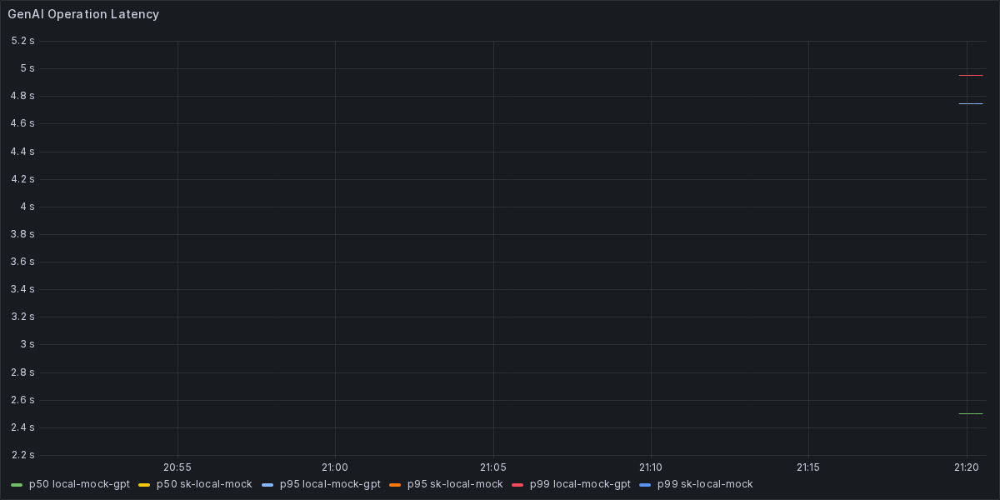
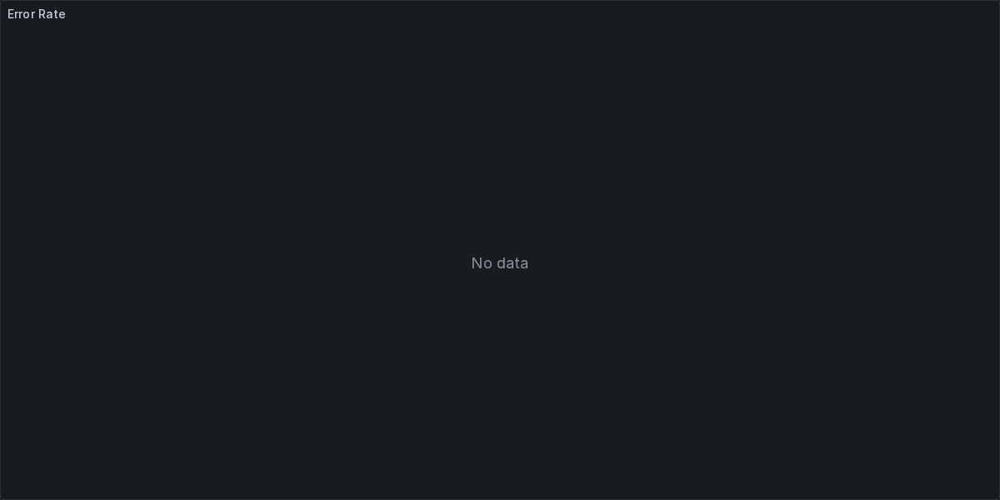

# otel-genai-bridges

> OpenTelemetry-powered GenAI instrumentation packs for LangChain4j and Semantic Kernel with ready-to-run observability stack and demos.

## Why This Matters

Modern AI applications need production-grade observability. This repository bridges the gap between OpenTelemetry GenAI semantic conventions and popular orchestration frameworks (LangChain4j + Spring Boot, Semantic Kernel for .NET). It ships libraries, samples, dashboards, and automation so teams can trace, measure, and troubleshoot AI workloads end-to-end.

## Quickstart

**Prerequisites** ([detailed guide](docs/QUICKSTART.md))

- Docker Desktop 4.28+
- JDK 17 or newer
- .NET 8 SDK

```bash
# 1. Clone the repo (replace with your fork)
git clone https://github.com/dineshkumarkummara/otel-genai-bridges.git
cd otel-genai-bridges

# 2. Boot the full observability + sample stack
./scripts/run_all.sh
```

Windows PowerShell users can run `./scripts/run_all.ps1`.

After the stack is running:

```bash
# Chat completion via LangChain4j + Spring Boot
curl -s http://localhost:8080/api/chat \
  -H "Content-Type: application/json" \
  -d '{"question":"How do GenAI semantic conventions work?"}' | jq

# RAG-flavoured chat via Semantic Kernel
curl -s http://localhost:7080/rag \
  -H "Content-Type: application/json" \
  -d '{"question":"Explain OpenTelemetry for GenAI"}' | jq
```

Grafana (http://localhost:3000/d/genai-overview) shows latency quantiles, token usage, error budgets, cost/sec, tool usage, and RAG latency. Tempo exposes spans, while Prometheus scrapes the Collector metrics endpoint.

## Observability in Action

<p align="center">
  
</p>
<p align="center">
  
</p>
<p align="center">
  
</p>

_Screenshots captured from the bundled Grafana dashboard after running `./scripts/run_all.sh`._

## Architecture at a Glance

- **LangChain4j starter** (`java/libs/langchain4j-otel`) – Auto-wraps LangChain4j models in Spring Boot apps, emitting spans, events, and metrics (latency, tokens, cost, tool calls, RAG latency).
- **Spring Boot sample** (`java/samples/rag-springboot`) – In-memory knowledge base delivering `/chat` and `/rag` endpoints plus curl helpers.
- **Semantic Kernel instrumentation** (`dotnet/libs/sk-otel`) – DelegatingHandler + ASP.NET Core middleware to capture prompts, completions, tool calls, and cost.
- **Semantic Kernel sample** (`dotnet/samples/sk-chat`) – Minimal API showcasing middleware integration and synthetic RAG retrieval timing.
- **Observability stack** (`collector/`, `dashboards/`) – Docker Compose for Collector → Tempo/Prometheus → Grafana with pre-provisioned dashboards.
- **Automation** (`scripts/`, `.github/workflows/`) – One-liner launcher scripts and CI pipelines.

## Use in Your Project

- **LangChain4j / Spring Boot** – Declare the starter dependency, configure `otel.langchain4j.*` properties, and the auto-configuration does the rest. See [`docs/snippets/langchain4j.md`](docs/snippets/langchain4j.md).
- **Semantic Kernel (.NET)** – Call `AddSemanticKernelTelemetry`, register the middleware, and (optionally) hook the DelegatingHandler into outbound SK HTTP clients. Snippet in [`docs/snippets/semantic-kernel.md`](docs/snippets/semantic-kernel.md).

## Advanced Integration

- vLLM endpoint tracing (planned) — future iterations will add a small vLLM client wrapper inside the Java sample so hybrid deployments can correlate in-house vLLM responses with upstream provider calls.

## Standards Alignment

- [OpenTelemetry Semantic Conventions for GenAI](https://github.com/open-telemetry/semantic-conventions/blob/main/docs/gen-ai/general.md)
- [OTLP over HTTP & gRPC](https://opentelemetry.io/docs/specs/otlp/)

All source files include Apache-2.0 compatible headers alongside the MIT project license to simplify upstream contributions.

## How to Contribute

1. Fork the repo and create a feature branch (`git checkout -b feature/amazing-improvement`).
2. Run the linters/tests (`./mvnw -f java/pom.xml -pl libs/langchain4j-otel test`, `dotnet test dotnet/libs/sk-otel.Tests/SkOtel.Tests.csproj`).
3. Update docs/dashboards/scripts when telemetry semantics change (include screenshots for UX tweaks).
4. Open a PR with clear context, behaviour, and verification steps.

We follow the [Contributor Covenant](https://www.contributor-covenant.org/); respectful collaboration is expected.

## Roadmap & Ideas

- ☁️ Terraform modules for managed Tempo/Grafana Cloud deployments.
- 📦 Publish artifacts to Maven Central & NuGet after stabilising APIs.
- 🔌 Drop-in enrichers for specific LLM providers (Azure OpenAI, Bedrock, Gemini).
- 🧪 Golden-signal smoke tests driven by dockerised scenarios.

---

> Maintained with ❤️ for the OpenTelemetry + GenAI community.
